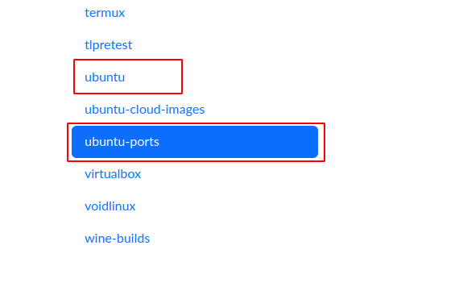
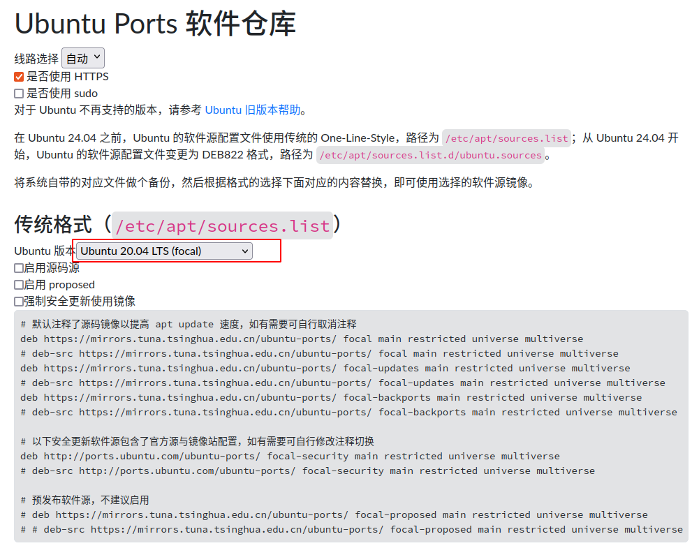

# aarch64 环境搭建简单步骤

## git clone source-code from CODING

```sh
mkdir -p catkin_ws/src
cd catkin_ws/src

# fairland_msgs
git clone git@e.coding.net:g-snex1877/flbot_project/fairland_msgs.git
# flbot_thirdparty
git clone git@e.coding.net:g-snex1877/flbot_project/flbot_thirdparty.git
# localization_module
git clone git@e.coding.net:g-snex1877/flbot_project/localization_module.git

# localization_module 切换到 branch: mapping_localization

```


## 在 ~/.bashrac 中添加

```sh
export CPATH=$CPATH:$HOME/catkin_ws/src/flbot_thirdparty/fmt/aarch64/include

#（运行 devel 中的可执行文件需要）
export LD_LIBRARY_PATH=$LD_LIBRARY_PATH:$HOME/catkin_ws/src/flbot_thirdparty/gtsam/aarch64/lib
export LD_LIBRARY_PATH=$LD_LIBRARY_PATH:$HOME/catkin_ws/src/flbot_thirdparty/Pangolin/aarch64/lib
export LD_LIBRARY_PATH=$LD_LIBRARY_PATH:$HOME/catkin_ws/src/flbot_thirdparty/opencv/aarch64/lib
export LD_LIBRARY_PATH=$LD_LIBRARY_PATH:$HOME/catkin_ws/src/flbot_thirdparty/pcl/aarch64/lib

```


## 升级系统eigen

由于 flbot_thirdparty 中已经有eigen3.4.0编译好的库，直接将其拷贝到系统路径 /usr/include

```sh
############# 备份原有eigen库

# 备份include
sudo cp /usr/include/eigen3 /usr/include/eigen3-3.3.7-bak

# 备份 cmake 查找文件
cd /usr/lib/cmake
sudo tar -zcvf eigen3-cmake-bak.tar.gz eigen3/
sudo rm -r eigen3/

############# 拷贝 eigen3.4.0
mkdir -p /usr/lib/cmake/eigen3/
sudo cp -r [your workspace]/src/flbot_thirdparty/eigen3/aarch64/share/eigen3/cmake/* /usr/lib/cmake/eigen3/
sudo cp -r [your workspace]/src/flbot_thirdparty/eigen3/aarch64/include/eigen3/ /usr/include
# 如果 工作空间为 ~/catkin_ws
sudo cp -r ~/catkin_ws/src/flbot_thirdparty/eigen3/aarch64/share/eigen3/cmake/* /usr/lib/cmake/eigen3/
sudo cp -r ~/catkin_ws/src/flbot_thirdparty/eigen3/aarch64/include/eigen3/ /usr/include
```


## 编译运行

```sh
cd ~/catkin_ws/src
catkin_make 
```


# aarch64 环境搭建详细步骤


## ubuntu 更换软件源

### 选择软件源

选用 [清华大学开源软件镜像站](https://mirrors.tuna.tsinghua.edu.cn) 的软件源（当然也可以选用阿里华为等的软件源）。

### 适配硬件架构以及系统版本

左侧列表中选择合适的源：

- x86 架构： ubuntu
- arm 架构等： ubuntu-ports



选择适配的 ubuntu 版本



### 替换源内容

备份`/etc/apt/sources.list` 为 `/etc/apt/sources.list.bak`

复制上述软件源内容，替换 掉`/etc/apt/sources.list` 中的内容。


## ROS 安装

- 添加ROS源

  [Linux](https://so.csdn.net/so/search?q=Linux&spm=1001.2101.3001.7020)在安装软件的时候，需要通过源列表去寻找对应的一个软件，Ubuntu默认的软件列表是没有ROS的，需要把 packags.ros.org 这样的一个网站给配置到我们的软件仓库列表内才能下载ROS，不然显示的是没有这个软件（因为你的软件列表，也就是源列表没有）。

  ```sh
  sudo sh -c 'echo "deb http://packages.ros.org/ros/ubuntu $(lsb_release -sc) main" > /etc/apt/sources.list.d/ros-latest.list'
  ```

- 添加密钥

  配置公网密钥，这一步是确保我们的系统认为这个路径是安全的，下载文件是没有问题的。不然下载的东西会立刻被清除掉。

  ```sh
  sudo apt-key adv --keyserver 'hkp://keyserver.ubuntu.com:80' --recv-key C1CF6E31E6BADE8868B172B4F42ED6FBAB17C654
  ```

- ROS 安装

  在加入了新的源之后，需要对源列表进行一次更新，在终端输入sudo apt-get update即可进行更新。

  ```sh
  sudo apt-get update
  ```

  安装 ROS 桌面完整版：

  ```sh
  sudo apt-get install ros-noetic-desktop-full
  ```

- 配置ROS

  ```sh
  echo "source /opt/ros/noetic/setup.bash" >> ~/.bashrc
  source ~/.bashrc
  ```

- 安装 rosinstall

  ```sh
  sudo apt install python3-rosinstall python3-rosinstall-generator python3-wstool build-essential
  ```

  

## localization_module 运行

### git clone source-code from CODING

```sh
cd catkin_ws/src

# fairland_msgs
git clone git@e.coding.net:g-snex1877/flbot_project/fairland_msgs.git
# flbot_thirdparty
git clone git@e.coding.net:g-snex1877/flbot_project/flbot_thirdparty.git
# localization_module
git clone git@e.coding.net:g-snex1877/flbot_project/localization_module.git

```


### 编译

```sh
# 回到 catkin 工作空间编译
cd ~/catkin_ws/src
catkin_make 
```


### 问题1--fmt 问题

- 问题

```sh
# ***/flbot_thirdparty/Sophus/aarch64/include/sophus/common.hpp:35:10: fatal error: fmt/format.h: 没有那个文件或目录
```

- 解决办法

```sh
# 将 flbot_thirdparty 下的对应CPU架构版本的fmt库的include路径添加到 CPATH 环境变量，将这行命令添加到 ~/.bashrc 文件中，举2个例子如下
echo "export CPATH=$CPATH:$HOME/catkin_ws/src/flbot_thirdparty/fmt/x86/include" >> ~/.bashrc
echo "export CPATH=$CPATH:$HOME/catkin_ws/src/flbot_thirdparty/fmt/aarch64/include" >> ~/.bashrc
source ~/.bashrc
```


### 问题2-- gtsam 的 eigen3 与系统的版本冲突问题

- 问题

  ```sh
  # 编译过程中出现gtsam的版本冲突问题
  ```

- 原因

  ```sh
  # gtsam编译依赖的eigen版本为3.4.0，ubuntu系统自带版本为3.3.7，
  # 可能原因，gtsam库在编译时，选项设置了依赖系统库，导致其被引用时也在找系统库（待求证）
  ```

- 解决办法

  ```sh
  # 将系统目录下 /usr/include 路径下的 eigen3 升级为3.4.0
  ```

  - 升级步骤：（测试可用）

    由于 flbot_thirdparty 中已经有eigen3.4.0编译好的库，直接将其拷贝到系统路径 /usr/include

    ```sh
    ############# 备份原有eigen库
    
    # 备份include
    sudo cp /usr/include/eigen3 /usr/include/eigen3-3.3.7-bak
    
    # 备份 cmake 查找文件
    cd /usr/lib/cmake
    sudo tar -zcvf eigen3-cmake-bak.tar.gz eigen3/
    sudo rm -r eigen3/
    
    ############# 拷贝 eigen3.4.0
    mkdir -p /usr/lib/cmake/eigen3/
    cd /usr/lib/cmake/eigen3/
    sudo cp    [your workspace]/src/flbot_thirdparty/eigen3/aarch64/share/eigen3/cmake/* ./
    
    sudo cp -r [your workspace]/src/flbot_thirdparty/eigen3/aarch64/include/eigen3/ /usr/include
    ```

    